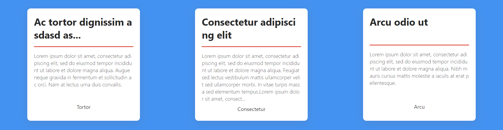

### docure-list

```js
npm i @specialdoom/docure-list
```

### usage

```html
<docure-list>
    <ul>
      <li>
        <h2>
          Card title
        </h2>
        <p>
          Description text
        </p>
        <div>
          <docure-button secondary>Action</docure-button>
        </div>
      </li>
      <li>
        <h2>
          Card title
        </h2>
        <p>
          Description text
        </p>
        <div>
          <docure-button secondary>Action</docure-button>
        </div>
      </li>
      <li>
        <h2>
          Card title
        </h2>
        <p>
          Description text
        </p>
        <div>
          <docure-button secondary>Action</docure-button>
        </div>
      </li>
    </ul>
  </docure-list>
```

### example 

